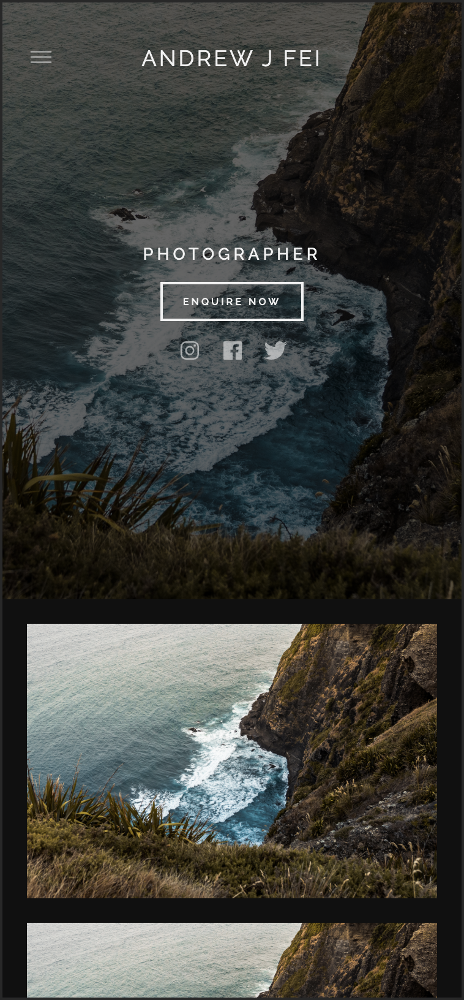

# Andrew J Fei

This is a project aimed towards creating a photography website.

The end goal for this project is to eventually be able to start up a freelancing photography business.

I have found a passion for photography over the years, and decided that it would be a good idea to start a buisness doing photography. Currently, studying software engineering it only made sense for me to try add create my own photography website from scratch rather than using third parties such as Wix, SquareSpace, etc.

This website was built using Angular version 9.0.

Website Link: https://andrewjfei.com/

The website is currently being hosted on github pages.

**NOTE: Images on the website are placeholders until the website is offically complete and ready for launch.**

## Website Functionality
* 📱[**Responsive**](#responsive-website): Website is accessible from all devices, where elements on the screen change depending on the screen size.
* 🎇[**Dynamic Front-End**](#dynamic-front-end): Images in the gallery can be changed dynamically by adding/removing images from the respective Google Cloud Storage bucket.
* 📈[**Analytics**](#analytics): Not currently implemented.
* ✉️[**Automated Emails**](#automated-emails): Not currently implemented.
* 👕[**Store Service**](#store-service): Not currently implemented.

## Contents
- [Getting Started](#getting-started)
- [Functionality](#functionality)
- [Future Implementations](#future-implementations)

## Getting Started

### Cloning the Repository

Make sure you have `git` installed. Visit https://git-scm.com/ for more information.

Open up terminal on your local device. Navigate to a directory where you want the repository to be cloned to, by using the `cd` command. Run `git clone https://github.com/andrewjfei/andrewjfei-website.git` to clone this repository to your desired destination.

### Running Locally

Once you have cloned the repository, change directory into the cloned repository by running `cd andrewjfei-website`. Then run `ng serve` to start up a development server. Open up a browser and then navigate to `http://localhost:4200/`, the app should be loaded. 

**The app will automatically reload if you change any of the source files.**

## Functionality

All website functionalities will be described in detail and how they are achieved/implemented.

### Responsive Website 📱

This functionaly allows the elements within the website to change depending on the screen size viewing the website. By making the website responsive it allows better usability for the user.

Below are examples of the website views on different screen sizes.

**Website View**

**Mobile View**

The responsiveness of the website was achieved by using _Media Queries_ in CSS.

### Dynamic Front-End 🎇

When accessing the **Gallery** section of the website, you will notice that the images may take some time to load. This is because the images are being retrieved from a url provided by Google Cloud Storage.

All images in the **Gallery** are stored on in a bucket on Google Cloud. Adding/removing images from the bucket on the cloud will dynamically change the images that are show on the website.

I achieved this functionality by making the buckets storing the images public and then by using the Google Cloud Storage GET request to retrieve the JSON data for a specific bucket, and then mapping through the data to render the images on the website.

## Future Implementations

Not all the functionalty of the website have currently been implemented due to some limitations and contraints. However, these functions will be worked on in the furture to achieve the end goal and vision of the website.

### Analytics 📈

Being able to understand where your website traffic is coming from is extremely useful and important. To achieve and obtain these analtics, Google Analytics will be used and implemented.

### Automated Emails ✉️

The main purpose of this website was to showcase my photography work to potentially attract potential customers. If customers are happy with what they see they will need some way of being able to contact me. The solution to this would be to allow users to complete a contact form in which on sumbitting would automate an email to my personal email address.

The Gmail API would be used to achieve this functionality.

### Store Service 👕

## License
